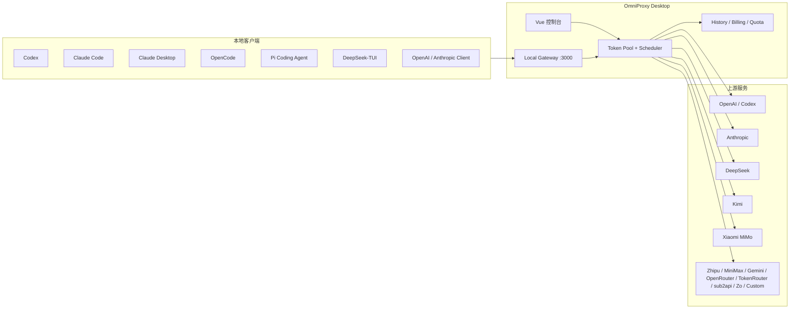

# OmniProxy

<div align="center">

**本地优先的 AI API 网关、账号调度器与额度观测控制台**

把 Codex、Claude Code、Claude Desktop、OpenCode、Pi Coding Agent、DeepSeek-TUI、Gemini CLI 以及 OpenAI / Anthropic 兼容客户端统一接入本机代理，由 OmniProxy 在本地完成账号选择、鉴权注入、失败重试、额度刷新、用量统计和客户端配置写入。

[English](README_EN.md) · [发布记录](docs/releases) · [Releases](https://github.com/mibgb65-cloud/OmniProxy/releases)


</div>

## 为什么需要 OmniProxy

本地 AI 开发工具越来越多，账号、Base URL、模型和额度状态却散落在不同配置文件里。OmniProxy 把这些分散状态收拢到一个本地桌面控制台中：

- 多个账号不再手动切换，由调度器按状态、选择范围和并发占用自动挑选。
- 客户端只连接 `127.0.0.1`，真实上游 Token 留在本机，由代理按厂商注入。
- Codex、Claude Code、Claude Desktop、OpenCode、Pi Coding Agent、DeepSeek-TUI 等工具可以一键写入本地代理配置，并保留备份用于恢复。
- 请求历史、模型 Token、失败原因、额度重置时间、API Key 余额和本地账单统计统一可见。

OmniProxy 不是云端中转服务。它面向个人本地开发场景，默认只监听 loopback 地址，凭据保存在本机数据目录中。

## 核心能力

| 能力 | 说明 |
| --- | --- |
| 本地透明代理 | 暴露 OpenAI、Anthropic、Codex、Pi、TokenRouter、Zo Computer 等本地入口，自动注入上游鉴权。 |
| 多账号调度 | 支持队列模式、优先平衡使用、账号选择范围、低额度跳过和并发占用避让。 |
| 失败自动切换 | 上游返回 `429`、`502`、`503`、`504` 等可重试错误时，自动换账号重试。 |
| 额度观测 | 展示 API 余额、订阅额度、重置时间、Codex Free 周额度、Coding Plan 用量、OpenRouter 余额和按币种汇总的 API Key 余额。 |
| 用量统计 | 记录请求历史、客户端来源、模型、输入 / 输出 / 总 Token、失败原因、每日账单快照和账单明细洞察。 |
| 客户端配置 | 一键配置 Codex、Claude Code、Claude Desktop、Gemini CLI、OpenCode、Pi Coding Agent、DeepSeek-TUI，并支持恢复原配置。 |
| 现代桌面控制台 | Gemini 风格浅色 / 深色主题，统一卡片、弹窗、下拉框、滚动和消息提示，适合长时间观察本地代理状态。 |
| Claude 模型槽位 | 可从 DeepSeek、MiMo、Kimi、GLM、Zo Computer 模型中选择最多 4 个模型写入 Claude Code / Claude Desktop。 |
| Zo Computer 网关 | 通过本地 `/zo` 和 `/zo/v1` 入口适配 OpenAI Chat Completions、OpenAI Responses、Anthropic Messages 和模型列表。 |
| 本地安全存储 | Windows 上使用当前用户 DPAPI 加密账号凭据，导出备份时保持显式可控。 |

## 架构



## 最新变化

- **Gemini 风格界面重构**：桌面控制台统一为现代极简样式，覆盖仪表盘、额度、账号管理、请求历史、实时日志、用量趋势、费用账单、一键配置、全局设置和 OpenRouter 对话等页面。
- **桌面交互优化**：统一下拉框、弹窗、全局消息提示、滚动条、按钮和卡片样式；各子页面独立记录滚动位置，实时日志改为仅展示最近 5 分钟并在页面内部滚动。
- **Zo Computer 网关**：新增 Go 原生 Zo Computer 适配，支持 `/zo/v1/chat/completions`、`/zo/v1/responses`、`/zo/v1/messages` 和模型列表兼容接口。
- **Zo 一键配置**：Codex、Claude Code、OpenCode、Pi Coding Agent 支持写入 Zo Computer 本地入口，内置 GPT-5.5、GPT-5.4、GLM 5、Gemini 3.1 Pro、MiniMax 2.7、DeepSeek V4 Pro、Claude Opus 4.7 和 Claude Sonnet 4.6 等模型预设。
- **Claude Desktop 与 DeepSeek-TUI**：新增 Claude Desktop 3P Gateway Profile 和 DeepSeek-TUI 本地配置写入 / 恢复。
- **API Key 余额汇总**：厂商额度页和账号管理页支持按币种汇总 API Key 余额，GLM 等资源包明细会保留展示。
- **账单明细增强**：费用账单右侧明细区新增费用洞察、模型占比和未纳入模型摘要，并优化暗色模式海报预览。
- **Codex Chat Completions 兼容入口**：新增 `/codex/v1/chat/completions`，可用 OpenAI `auth.json` 账号接入 OpenAI Chat Completions 客户端，内部自动转换到 Codex Responses 后端。
- **Codex 流式响应转换**：Codex Responses 的 SSE 事件会转换为 `chat.completion.chunk`，非流式请求会汇总为 `chat.completion` 响应。
- **Codex 模型与参数适配**：支持 `gpt-5.4-high` 等 Codex CLI 模型别名，并保留 `max_completion_tokens`、`reasoning_effort`、tools / function calling 等常用参数。
- **Codex 请求体兼容**：支持解码 Codex 发往本地 Responses 入口的 zstd / gzip 压缩请求体。

## 快速开始

### 下载使用

1. 从 [GitHub Releases](https://github.com/mibgb65-cloud/OmniProxy/releases) 下载 Windows 安装包。
2. 启动 OmniProxy，在「账号管理」添加至少一个上游账号。
3. 在「全局设置」确认代理端口和厂商 Base URL。
4. 启动本地代理。
5. 将客户端 Base URL 指向 `http://127.0.0.1:3000`，或使用「一键配置」写入本地客户端配置。

### 从源码运行

依赖：

- Go
- Node.js
- Wails v2 CLI

```powershell
cd .\OmniProxyBackend
C:\Users\mimanchi\go\bin\wails.exe dev
```

或使用仓库脚本：

```powershell
.\scripts\dev.ps1
```

## 本地入口

| 协议 / 客户端 | 正式版地址 | Dev 版地址 |
| --- | --- | --- |
| OpenAI compatible | `http://127.0.0.1:3000` | `http://127.0.0.1:3001` |
| Codex backend | `http://127.0.0.1:3000/backend-api/codex` | `http://127.0.0.1:3001/backend-api/codex` |
| Codex Chat Completions | `http://127.0.0.1:3000/codex/v1` | `http://127.0.0.1:3001/codex/v1` |
| Claude router | `http://127.0.0.1:3000/anthropic-router` | `http://127.0.0.1:3001/anthropic-router` |
| Pi router | `http://127.0.0.1:3000/pi-router/v1` | `http://127.0.0.1:3001/pi-router/v1` |
| TokenRouter | `http://127.0.0.1:3000/tokenrouter/v1` | `http://127.0.0.1:3001/tokenrouter/v1` |
| Zo Computer | `http://127.0.0.1:3000/zo/v1` | `http://127.0.0.1:3001/zo/v1` |
| Control API | `http://127.0.0.1:3890/api` | `http://127.0.0.1:3891/api` |

默认数据目录：

| 版本 | 数据目录 | 指针文件 |
| --- | --- | --- |
| 正式版 | `%USERPROFILE%\.omniproxy` | `%USERPROFILE%\.omniproxy-bootstrap.json` |
| Dev 版 | `%USERPROFILE%\.omniproxy-dev` | `%USERPROFILE%\.omniproxy-dev-bootstrap.json` |

## 支持矩阵

| 厂商 | 凭据类型 | 主要能力 |
| --- | --- | --- |
| OpenAI | API Key | OpenAI 兼容请求、rate-limit header 余量记录。 |
| OpenAI / Codex | `auth.json` | 自动解析邮箱、access token、account id，刷新 Codex 订阅额度，支持 Codex Responses 与 Chat Completions 兼容转换。 |
| Anthropic | API Key | Anthropic 原生请求和 Claude Code 路由。 |
| Anthropic / Claude | OAuth JSON | 支持 `access_token` / `refresh_token` 的 Claude OAuth JSON。 |
| DeepSeek | API Key | OpenAI 兼容入口和 Anthropic router。 |
| Kimi | API Key | Kimi Code 相关路由和订阅用量刷新。 |
| Xiaomi MiMo | API Key | 按量 API Key，通常以 `sk-` 开头。 |
| Xiaomi MiMo | Token Plan | Token Plan Key，通常以 `tp-` 开头，支持订阅额度展示。 |
| Zhipu GLM | API Key / Coding Plan | OpenAI 兼容、Anthropic router、Coding Plan 用量刷新。 |
| MiniMax | API Key | OpenAI 兼容入口和 Anthropic router。 |
| Gemini | API Key | Gemini API 路由和 Gemini CLI 一键配置。 |
| OpenRouter | API Key | 模型列表、余额查询、桌面端对话。 |
| TokenRouter | API Key | OpenAI 兼容路由，API Key 通常以 `tr_` 开头。 |
| sub2api | API Key | OpenAI / Anthropic / Gemini 兼容网关，支持 Codex 本地配置入口。 |
| Zo Computer | Access Token | OpenAI Chat Completions、OpenAI Responses、Anthropic Messages、模型列表和客户端模型预设。 |
| 自定义网关 | API Key | OpenAI / Anthropic 兼容网关。 |

## 客户端一键配置

| 客户端 | 支持内容 |
| --- | --- |
| Codex | 写入本地 Codex backend 代理地址，也可切换到 sub2api 或 Zo Computer 本地入口，支持恢复备份。 |
| Claude Code | 写入 Anthropic router，可选择 DeepSeek / MiMo / Kimi / GLM / Zo Computer 模型槽位。 |
| Claude Desktop | 写入 3P Gateway Profile，可复用 Claude 模型选择结果，配置后需要重启 Claude Desktop。 |
| Gemini CLI | 写入 Gemini 本地代理配置。 |
| OpenCode | 写入本地 provider 配置，支持 Gemini、OpenRouter、TokenRouter、Zo Computer 和自定义网关 provider。 |
| Pi Coding Agent | 写入 OmniProxy 和 Zo Computer provider，统一通过 `/pi-router/v1` 或 `/zo/v1` 按模型分流。 |
| DeepSeek-TUI | 写入 DeepSeek-TUI 配置，使用内置 DeepSeek provider 连接 OmniProxy 的 DeepSeek 账号池。 |

## 控制 API

桌面前端优先通过 Wails 绑定调用后端。HTTP 控制 API 保留给本地脚本和调试工具使用。除 `GET /api/control-token` 外，其它接口需要携带 `X-OmniProxy-Control-Token`，也支持 `Authorization: Bearer <token>`。

常用端点：

| 类型 | 端点 |
| --- | --- |
| 账号 | `GET /api/tokens`、`POST /api/tokens`、`POST /api/tokens/import-api-keys`、`PUT /api/tokens/{id}`、`DELETE /api/tokens/{id}` |
| 调度 | `PUT /api/tokens/{id}/selected`、`PUT /api/tokens/{id}/exclusive`、`DELETE /api/tokens/{id}/exclusive` |
| 验证 | `POST /api/tokens/{id}/validate` |
| 代理 | `GET /api/proxy/status`、`POST /api/proxy/start`、`POST /api/proxy/stop`、`GET /api/proxy/active-requests` |
| 配置 | `GET /api/config`、`PUT /api/config`、`GET /api/data-directory`、`PUT /api/data-directory` |
| 历史 | `GET /api/logs`、`GET /api/history`、`POST /api/history/clear` |
| 账单 | `GET /api/billing/usage`、`GET /api/billing/dates`、`POST /api/billing/clear` |
| 客户端配置 | `POST /api/codex/configure`、`POST /api/codex/sub2api/configure`、`POST /api/codex/zo/configure`、`POST /api/claude/models/configure`、`POST /api/claude/desktop/models/configure`、`POST /api/zo/claude/configure`、`POST /api/deepseek-tui/configure`、`POST /api/opencode/configure`、`POST /api/pi/configure` |
| 更新 | `POST /api/update/check`、`POST /api/update/download`、`GET /api/update/download/status`、`POST /api/update/install` |

`/selected` 用于把账号加入或移出所属厂商的调度选择集合。没有已选账号时，调度器默认轮换该厂商全部可用账号；存在已选账号时，只在已选账号内轮换。

## 开发与验证

```powershell
cd .\OmniProxyBackend
go test ./...
```

```powershell
cd .\OmniProxyBackend\frontend
npm test
npm run build
```

正式构建：

```powershell
cd .\OmniProxyBackend
C:\Users\mimanchi\go\bin\wails.exe build
```

可与正式版共存的 Dev 构建：

```powershell
powershell -ExecutionPolicy Bypass -File .\scripts\build-dev.ps1 -Version dev -OutputName OmniProxy-dev.exe
```

Dev 版使用 `omniproxy_dev` build tag，应用标题、单实例 ID、数据目录和默认端口都与正式版隔离，适合在已安装正式版的机器上并行验证。

## 项目结构

```text
.
├── OmniProxyBackend/              # Wails 桌面主工程与 Go 后端
│   ├── internal/config/           # 本地配置、数据目录、默认值
│   ├── internal/logs/             # 请求和诊断日志
│   ├── internal/proxy/            # 代理、路由、鉴权、用量解析、WebSocket
│   ├── internal/storage/          # JSON / SQLite 本地持久化
│   ├── internal/token/            # 账号模型、Token 池、调度、额度状态
│   └── frontend/                  # Vue 3 + Vite + Element Plus 前端
├── docs/releases/                 # 人工整理的发布说明
├── scripts/dev.ps1                # 桌面开发启动脚本
├── scripts/build-dev.ps1          # 可共存 Dev exe 构建脚本
├── README.md                      # 中文文档
└── README_EN.md                   # English README
```

## 发布通道

| 通道 | Tag 示例 | GitHub Release 行为 |
| --- | --- | --- |
| Stable | `v1.1.7` | 正式 Release，适合日常使用。 |
| Beta | `v1.1.8-beta.2` | Pre-release，适合验证新功能和回归修复。 |
| Dev | `dev-*` | 本地构建版本，不作为公开 Release。 |

发布说明位于 `docs/releases/`。Beta 版本会标记为 GitHub Pre-release，正式版保留给稳定发布。

## 安全模型

- 默认只绑定 `127.0.0.1`，不面向公网或局域网暴露。
- 控制 API 使用本地控制令牌保护，桌面端自动获取和携带。
- Windows 上账号凭据使用当前用户 DPAPI 加密写入本地数据目录。
- 导出的账号池备份、Codex `auth.json` 和客户端配置备份可能包含真实凭据，请只保存到可信目录。
- 分享日志、截图或 Issue 前，请检查账号名、路径、请求 ID、Base URL 和 provider metadata。

## 路线图

- 更细粒度的额度趋势图和跨厂商对比视图。
- 更完整的 SSE、WebSocket、并发调度和异常恢复测试。
- 更多厂商、更多客户端工具和更多协议适配。
- 更严格的控制 API 本地访问边界。
- 更清晰的前端组件边界和可维护的设计系统。

## 贡献

欢迎提交 Issue 和 Pull Request。一个高质量问题报告通常包含：

- 操作系统、OmniProxy 版本和运行方式。
- 使用的客户端工具，例如 Codex、Claude Code、OpenCode、Pi Coding Agent 或自定义 API 客户端。
- 相关 provider、路由路径、模型名和错误日志。
- 预期行为、实际行为以及最小复现步骤。

提交 PR 前建议至少运行：

```powershell
cd .\OmniProxyBackend
go test ./...
```

```powershell
cd .\OmniProxyBackend\frontend
npm test
npm run build
```

## Star

如果 OmniProxy 改善了你的本地 AI 开发流程，欢迎点一个 Star。真实使用场景里的问题反馈、配置样例和回归用例，比泛泛的路线图更有价值。
