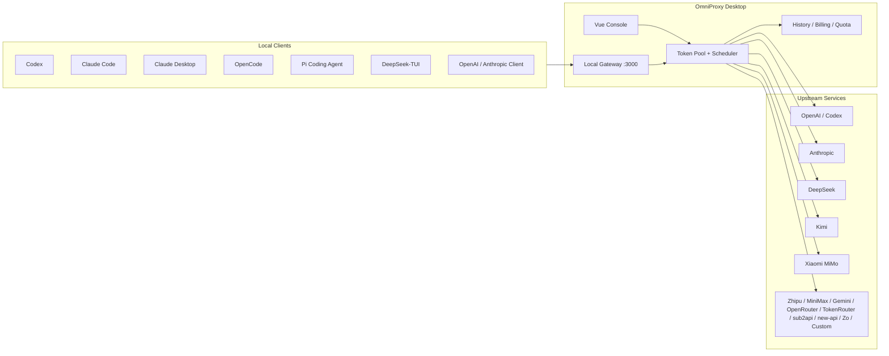

# OmniProxy

<div align="center">

**A local-first AI API gateway, account scheduler, and quota observability console**

Connect Codex, Claude Code, Claude Desktop, OpenCode, Pi Coding Agent, DeepSeek-TUI, Gemini CLI, and OpenAI / Anthropic-compatible clients to one local proxy. OmniProxy handles account selection, auth injection, failover retries, quota refresh, usage accounting, and local client configuration.

[中文](README.md) · [Release Notes](docs/releases) · [Releases](https://github.com/mibgb65-cloud/OmniProxy/releases)


</div>

## Why OmniProxy

Local AI development tools keep multiplying, while accounts, Base URLs, models, and quota states are scattered across different config files. OmniProxy pulls those scattered states into one local desktop console:

- Stop switching accounts manually; the scheduler picks accounts by status, selection scope, and in-flight usage.
- Clients only connect to `127.0.0.1`; real upstream tokens stay local and are injected by the proxy per provider.
- Codex, Claude Code, Claude Desktop, OpenCode, Pi Coding Agent, DeepSeek-TUI, and other tools can be configured with one click, with backups kept for restore.
- Request history, model tokens, failure reasons, quota reset times, API key balances, and local billing stats are visible in one place.

OmniProxy is not a cloud relay service. It is built for personal local development, binds to loopback by default, and stores credentials in the local data directory.

## Core Capabilities

| Capability | Description |
| --- | --- |
| Local transparent proxy | Exposes local OpenAI, Anthropic, Codex, Pi, TokenRouter, Zo Computer, and other entrypoints, then injects upstream auth automatically. |
| Multi-account scheduling | Supports queue mode, balanced priority, account selection scopes, low-quota skipping, and in-flight account avoidance. |
| Automatic failover | Retries with another usable account when upstream returns retryable errors such as `429`, `502`, `503`, or `504`. |
| Quota observability | Shows API balances, subscription quotas, reset times, Codex Free weekly quota, Coding Plan usage, OpenRouter balance, and API key balance totals grouped by currency. |
| Usage accounting | Records request history, client source, model, input / output / total tokens, failure reasons, daily billing snapshots, and billing detail insights. |
| Client configuration | One-click setup for Codex, Claude Code, Claude Desktop, Gemini CLI, OpenCode, Pi Coding Agent, and DeepSeek-TUI, with restore support. |
| Modern desktop console | Gemini-style light / dark themes with consistent cards, dialogs, dropdowns, scrolling, and snackbars for long-running local proxy monitoring. |
| Claude model slots | Writes up to 4 selected DeepSeek, MiMo, Kimi, GLM, or Zo Computer model slots into Claude Code / Claude Desktop. |
| Zo Computer gateway | Adapts OpenAI Chat Completions, OpenAI Responses, Anthropic Messages, and model lists through local `/zo` and `/zo/v1` entrypoints. |
| Local secure storage | On Windows, account credentials are encrypted with the current user's DPAPI profile; exported backups remain explicit and user-controlled. |

## Architecture



## Latest Changes

- **Gemini-style UI refresh**: The desktop console now uses a modern minimal visual system across Dashboard, Quota, Account Management, Request History, Realtime Logs, Usage Trends, Billing, One-click Setup, Global Settings, and OpenRouter Chat.
- **Desktop interaction polish**: Dropdowns, dialogs, global snackbars, scrollbars, buttons, and cards now share one visual language. Each page keeps its own scroll position, and Realtime Logs now shows only the latest 5 minutes with internal scrolling.
- **Zo Computer gateway**: Added a Go-native Zo Computer adapter for `/zo/v1/chat/completions`, `/zo/v1/responses`, `/zo/v1/messages`, and compatible model-list endpoints.
- **Zo one-click setup**: Codex, Claude Code, OpenCode, and Pi Coding Agent can write Zo Computer local entrypoints, with presets for GPT-5.5, GPT-5.4, GLM 5, Gemini 3.1 Pro, MiniMax 2.7, DeepSeek V4 Pro, Claude Opus 4.7, and Claude Sonnet 4.6.
- **Claude Desktop and DeepSeek-TUI**: Added local write / restore support for Claude Desktop 3P Gateway Profile and DeepSeek-TUI configuration.
- **API Key balance summaries**: Provider quota and account pages group API key balances by currency, while preserving package details such as GLM resource packages.
- **Billing detail polish**: The billing detail sidebar now includes cost insights, model share bars, ignored-model summaries, and improved dark-mode poster previews.
- **Codex Chat Completions compatibility**: Added `/codex/v1/chat/completions`, allowing OpenAI Chat Completions clients to use OpenAI `auth.json` accounts through automatic conversion to the Codex Responses backend.
- **Codex streaming conversion**: Codex Responses SSE events are converted to `chat.completion.chunk`, and non-streaming requests are aggregated into `chat.completion` responses.
- **Codex model and parameter adaptation**: Supports Codex CLI model aliases such as `gpt-5.4-high`, while preserving common parameters such as `max_completion_tokens`, `reasoning_effort`, tools, and function calling.
- **Codex request body compatibility**: Decodes zstd / gzip-compressed Codex request bodies sent to local Responses entrypoints.

## Quick Start

### Download and Use

1. Download the Windows installer from [GitHub Releases](https://github.com/mibgb65-cloud/OmniProxy/releases).
2. Start OmniProxy and add at least one upstream account in **Account Management**.
3. Confirm proxy port and provider Base URLs in **Global Settings**.
4. Start the local proxy.
5. Point your client Base URL to `http://127.0.0.1:3000`, or use **One-click Setup** to write local client configuration.

### Run from Source

Dependencies:

- Go
- Node.js
- Wails v2 CLI

```powershell
cd .\OmniProxyBackend
C:\Users\mimanchi\go\bin\wails.exe dev
```

Or use the repository helper script:

```powershell
.\scripts\dev.ps1
```

## Local Entrypoints

| Protocol / Client | Production URL | Dev URL |
| --- | --- | --- |
| OpenAI compatible | `http://127.0.0.1:3000` | `http://127.0.0.1:3001` |
| Codex backend | `http://127.0.0.1:3000/backend-api/codex` | `http://127.0.0.1:3001/backend-api/codex` |
| Codex Chat Completions | `http://127.0.0.1:3000/codex/v1` | `http://127.0.0.1:3001/codex/v1` |
| Claude router | `http://127.0.0.1:3000/anthropic-router` | `http://127.0.0.1:3001/anthropic-router` |
| Pi router | `http://127.0.0.1:3000/pi-router/v1` | `http://127.0.0.1:3001/pi-router/v1` |
| TokenRouter | `http://127.0.0.1:3000/tokenrouter/v1` | `http://127.0.0.1:3001/tokenrouter/v1` |
| Zo Computer | `http://127.0.0.1:3000/zo/v1` | `http://127.0.0.1:3001/zo/v1` |
| Control API | `http://127.0.0.1:3890/api` | `http://127.0.0.1:3891/api` |

Default data directories:

| Version | Data Directory | Bootstrap File |
| --- | --- | --- |
| Production | `%USERPROFILE%\.omniproxy` | `%USERPROFILE%\.omniproxy-bootstrap.json` |
| Dev | `%USERPROFILE%\.omniproxy-dev` | `%USERPROFILE%\.omniproxy-dev-bootstrap.json` |

## Support Matrix

| Provider | Credential Type | Main Capabilities |
| --- | --- | --- |
| OpenAI | API Key | OpenAI-compatible requests and rate-limit header balance recording. |
| OpenAI / Codex | `auth.json` | Parses email, access token, account id, refreshes Codex subscription quota, and supports Codex Responses / Chat Completions conversion. |
| Anthropic | API Key | Anthropic-native requests and Claude Code routing. |
| Anthropic / Claude | OAuth JSON | Supports Claude OAuth JSON with `access_token` / `refresh_token`. |
| DeepSeek | API Key | OpenAI-compatible entrypoint and Anthropic router. |
| Kimi | API Key | Kimi Code routing and subscription usage refresh. |
| Xiaomi MiMo | API Key | Pay-as-you-go API key, usually starts with `sk-`. |
| Xiaomi MiMo | Token Plan | Token Plan key, usually starts with `tp-`, with subscription quota display. |
| Zhipu GLM | API Key / Coding Plan | OpenAI-compatible routing, Anthropic router, and Coding Plan usage refresh. |
| MiniMax | API Key | OpenAI-compatible entrypoint and Anthropic router. |
| Gemini | API Key | Gemini API routing and Gemini CLI one-click setup. |
| OpenRouter | API Key | Model list, balance check, and desktop chat. |
| TokenRouter | API Key | OpenAI-compatible routing; API keys usually start with `tr_`. |
| sub2api | API Key | OpenAI / Anthropic / Gemini-compatible gateway with Codex local setup support. |
| new-api | API Key | OpenAI / Anthropic / Gemini-compatible gateway; defaults to `http://127.0.0.1:3000` and refreshes key quota via `/api/usage/token/`. |
| Zo Computer | Access Token | OpenAI Chat Completions, OpenAI Responses, Anthropic Messages, model lists, and client model presets. |
| Custom Gateway | API Key | OpenAI / Anthropic-compatible gateways. |

## One-click Client Setup

| Client | Supported Setup |
| --- | --- |
| Codex | Writes the local Codex backend proxy address, or switches to sub2api / new-api / Zo Computer local entrypoints, with backup restore support. |
| Claude Code | Writes the Anthropic router and selected DeepSeek / MiMo / Kimi / GLM / Zo Computer model slots. |
| Claude Desktop | Writes a 3P Gateway Profile and reuses selected Claude model slots; restart Claude Desktop after configuration. |
| Gemini CLI | Writes Gemini local proxy configuration. |
| OpenCode | Writes local provider configuration for Gemini, OpenRouter, TokenRouter, Zo Computer, and custom gateway providers. |
| Pi Coding Agent | Writes OmniProxy and Zo Computer providers, routing by model through `/pi-router/v1` or `/zo/v1`. |
| DeepSeek-TUI | Writes DeepSeek-TUI configuration so its built-in DeepSeek provider connects to OmniProxy's DeepSeek account pool. |

## Control API

The desktop frontend prefers Wails bindings. The HTTP control API remains available for local scripts and debugging tools. Except for `GET /api/control-token`, endpoints require `X-OmniProxy-Control-Token`; `Authorization: Bearer <token>` is also accepted.

Common endpoints:

| Type | Endpoints |
| --- | --- |
| Accounts | `GET /api/tokens`, `POST /api/tokens`, `POST /api/tokens/import-api-keys`, `PUT /api/tokens/{id}`, `DELETE /api/tokens/{id}` |
| Scheduling | `PUT /api/tokens/{id}/selected`, `PUT /api/tokens/{id}/exclusive`, `DELETE /api/tokens/{id}/exclusive` |
| Validation | `POST /api/tokens/{id}/validate` |
| Proxy | `GET /api/proxy/status`, `POST /api/proxy/start`, `POST /api/proxy/stop`, `GET /api/proxy/active-requests` |
| Config | `GET /api/config`, `PUT /api/config`, `GET /api/data-directory`, `PUT /api/data-directory` |
| History | `GET /api/logs`, `GET /api/history`, `POST /api/history/clear` |
| Billing | `GET /api/billing/usage`, `GET /api/billing/dates`, `POST /api/billing/clear` |
| Client setup | `POST /api/codex/configure`, `POST /api/codex/sub2api/configure`, `POST /api/codex/newapi/configure`, `POST /api/codex/zo/configure`, `POST /api/claude/models/configure`, `POST /api/claude/desktop/models/configure`, `POST /api/zo/claude/configure`, `POST /api/deepseek-tui/configure`, `POST /api/opencode/configure`, `POST /api/pi/configure` |
| Updates | `POST /api/update/check`, `POST /api/update/download`, `GET /api/update/download/status`, `POST /api/update/install` |

`/selected` adds or removes an account from its provider's scheduling selection set. When a provider has no selected accounts, the scheduler rotates all usable accounts for that provider; once selected accounts exist, rotation is limited to the selected set.

## Development and Verification

```powershell
cd .\OmniProxyBackend
go test ./...
```

```powershell
cd .\OmniProxyBackend\frontend
npm test
npm run build
```

Production build:

```powershell
cd .\OmniProxyBackend
C:\Users\mimanchi\go\bin\wails.exe build
```

Coexisting Dev build:

```powershell
powershell -ExecutionPolicy Bypass -File .\scripts\build-dev.ps1 -Version dev -OutputName OmniProxy-dev.exe
```

The Dev build uses the `omniproxy_dev` build tag. App title, single-instance ID, data directory, and default ports are isolated from the production build, so it is suitable for parallel validation on machines with the production app installed.

## Project Structure

```text
.
├── OmniProxyBackend/              # Wails desktop app and Go backend
│   ├── internal/config/           # Local config, data directory, defaults
│   ├── internal/logs/             # Request and diagnostic logs
│   ├── internal/proxy/            # Proxy, routing, auth, usage parsing, WebSocket
│   ├── internal/storage/          # JSON / SQLite local persistence
│   ├── internal/token/            # Account model, token pool, scheduling, quota state
│   └── frontend/                  # Vue 3 + Vite + Element Plus frontend
├── docs/releases/                 # Curated release notes
├── scripts/dev.ps1                # Desktop development launcher
├── scripts/build-dev.ps1          # Coexisting Dev exe build script
├── README.md                      # Chinese README
└── README_EN.md                   # English README
```

## Release Channels

| Channel | Tag Example | GitHub Release Behavior |
| --- | --- | --- |
| Stable | `v1.1.8` | Stable release for daily use. |
| Beta | `v1.1.8-beta.7` | Pre-release for validating new features and regression fixes. |
| Dev | `dev-*` | Local build version, not published as a public release. |

Release notes live in `docs/releases/`. Beta versions are marked as GitHub Pre-release, while stable versions are reserved for regular public releases.

## Security Model

- Binds only to `127.0.0.1` by default and does not expose itself to public networks or LANs.
- The control API is protected by a local control token that the desktop app fetches and sends automatically.
- On Windows, account credentials are encrypted with the current user's DPAPI profile before being written to the local data directory.
- Exported account-pool backups, Codex `auth.json`, and client configuration backups may contain real credentials; store them only in trusted directories.
- Before sharing logs, screenshots, or Issues, check for account names, paths, request IDs, Base URLs, and provider metadata.

## Roadmap

- Finer-grained quota trend charts and cross-provider comparison views.
- More complete SSE, WebSocket, concurrent scheduling, and recovery tests.
- More providers, more client tools, and more protocol adapters.
- A stricter local access boundary for the control API.
- Clearer frontend component boundaries and a more maintainable design system.

## Contributing

Issues and pull requests are welcome. A high-quality issue report usually includes:

- Operating system, OmniProxy version, and run mode.
- Client tool, such as Codex, Claude Code, OpenCode, Pi Coding Agent, or a custom API client.
- Related provider, route path, model name, and error logs.
- Expected behavior, actual behavior, and minimal reproduction steps.

Before submitting a PR, it is recommended to run at least:

```powershell
cd .\OmniProxyBackend
go test ./...
```

```powershell
cd .\OmniProxyBackend\frontend
npm test
npm run build
```

## Star

If OmniProxy improves your local AI development workflow, a Star is welcome. Real-world issue reports, configuration examples, and regression cases are more valuable than a generic roadmap.
