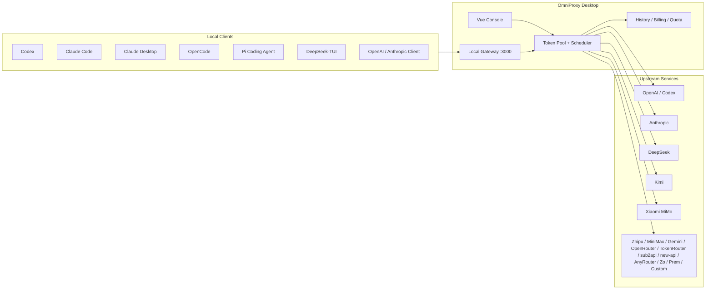

# OmniProxy

<div align="center">

**A local-first AI API gateway, account scheduler, and quota observability console**

Connect Codex, Claude Code, Claude Desktop, OpenCode, Pi Coding Agent, DeepSeek-TUI, Gemini CLI, and OpenAI / Anthropic-compatible clients to one local proxy. OmniProxy handles account selection, auth injection, failover retries, quota refresh, usage accounting, and local client configuration.

[中文](README.md) · [Release Notes](docs/releases) · [Releases](https://github.com/mibgb65-cloud/OmniProxy/releases)


</div>

## Why OmniProxy

Local AI development tools keep multiplying, while accounts, Base URLs, models, and quota states are scattered across different config files. OmniProxy pulls those scattered states into one local desktop console:

- Stop switching accounts manually; the scheduler picks accounts by status, selection scope, and in-flight usage.
- Clients only connect to `127.0.0.1`; real upstream tokens stay local and are injected by the proxy per provider.
- Codex, Claude Code, Claude Desktop, OpenCode, Pi Coding Agent, DeepSeek-TUI, and other tools can write stable local gateway entrypoints with one click; backend provider, credential type, and default model are selected on the **Gateway Routing** page.
- Request history, model tokens, failure reasons, quota reset times, API key balances, and local billing stats are visible in one place.

OmniProxy is not a cloud relay service. It is built for personal local development, binds to loopback by default, and stores credentials in the local data directory.

## Core Capabilities

| Capability | Description |
| --- | --- |
| Local transparent proxy | Exposes local OpenAI, Anthropic, Codex, Pi, TokenRouter, AnyRouter, Zo Computer, Prem, and other entrypoints, then injects upstream auth automatically. |
| Gateway routing | Provides stable Codex, Claude, OpenAI-compatible, and Gemini client entrypoints. Backend provider selection is centralized in the gateway, so switching providers no longer rewrites client config files. |
| Multi-account scheduling | Supports queue mode, balanced priority, account selection scopes, low-quota skipping, and in-flight account avoidance. |
| Automatic failover | Retries with another usable account when upstream returns retryable errors such as `429`, `502`, `503`, or `504`. |
| Quota observability | Shows API balances, subscription quotas, reset times, Codex Free weekly quota, Coding Plan usage, OpenRouter balance, and API key balance totals grouped by currency. |
| Usage accounting | Records request history, client source, model, input / output / total tokens, failure reasons, daily billing snapshots, and billing detail insights. |
| Client configuration | One-click setup for Codex, Claude Code, Claude Desktop, Gemini CLI, OpenCode, Pi Coding Agent, and DeepSeek-TUI, with restore support. |
| Modern desktop console | Gemini-style light / dark themes with consistent cards, dialogs, dropdowns, scrolling, and snackbars for long-running local proxy monitoring. |
| Claude model slots | Writes up to 4 selected DeepSeek, MiMo, Kimi, GLM, or Zo Computer model slots into Claude Code / Claude Desktop. |
| Zo Computer gateway | Adapts OpenAI Chat Completions, OpenAI Responses, Anthropic Messages, and model lists through local `/zo` and `/zo/v1` entrypoints. |
| Local secure storage | On Windows, credentials are encrypted with the current user's DPAPI profile. On macOS, OmniProxy stores a master key in Keychain and encrypts account credentials locally; exported backups remain explicit and user-controlled. |

## Architecture



## Latest Changes

- **Gemini-style UI refresh**: The desktop console now uses a modern minimal visual system across Dashboard, Quota, Account Management, Request History, Realtime Logs, Usage Trends, Billing, One-click Setup, Global Settings, and OpenRouter Chat.
- **Desktop interaction polish**: Dropdowns, dialogs, global snackbars, scrollbars, buttons, and cards now share one visual language. Each page keeps its own scroll position, and Realtime Logs now shows only the latest 5 minutes with internal scrolling.
- **Gateway routing settings**: Codex, Claude Code, Claude Desktop, OpenCode, Pi, DeepSeek-TUI, and Gemini CLI now write stable local entrypoints by default. Upstream provider, credential type, and default model are selected on the **Gateway Routing** page.
- **Zo Computer gateway**: Added a Go-native Zo Computer adapter for `/zo/v1/chat/completions`, `/zo/v1/responses`, `/zo/v1/messages`, and compatible model-list endpoints.
- **AnyRouter / Prem integration**: AnyRouter, Prem, and other third-party upstreams still support fixed direct paths and can also be selected as gateway-route backends, with OmniProxy handling scheduling and auth injection.
- **Claude Desktop and DeepSeek-TUI**: Added local write / restore support for Claude Desktop 3P Gateway Profile and DeepSeek-TUI configuration.
- **API Key balance summaries**: Provider quota and account pages group API key balances by currency, while preserving package details such as GLM resource packages.
- **Billing detail polish**: The billing detail sidebar now includes cost insights, model share bars, ignored-model summaries, and improved dark-mode poster previews.
- **Codex Chat Completions compatibility**: Added `/codex/v1/chat/completions`, allowing OpenAI Chat Completions clients to use OpenAI `auth.json` accounts through automatic conversion to the Codex Responses backend.
- **AnyRouter gateway**: Added AnyRouter account management, `/anyrouter/v1` Codex/OpenAI-compatible routing, and `/anyrouter/anthropic` Claude Code / Anthropic-compatible routing.
- **Prem gateway**: Added Prem account management and `/prem/v1` routing through the official local `pcci-proxy`, with OmniProxy selecting and injecting API keys for multi-key scheduling.
- **Codex streaming conversion**: Codex Responses SSE events are converted to `chat.completion.chunk`, and non-streaming requests are aggregated into `chat.completion` responses.
- **Codex model and parameter adaptation**: Supports Codex CLI model aliases such as `gpt-5.4-high`, while preserving common parameters such as `max_completion_tokens`, `reasoning_effort`, tools, and function calling.
- **Codex request body compatibility**: Decodes zstd / gzip-compressed Codex request bodies sent to local Responses entrypoints.

## Quick Start

### Download and Use

1. Download installers from [GitHub Releases](https://github.com/mibgb65-cloud/OmniProxy/releases). Beta releases may provide unsigned macOS DMGs for testing; daily use should prefer the Windows installer or a signed build.
2. Start OmniProxy and add at least one upstream account in **Account Management**.
3. Confirm client backend providers and default models on **Gateway Routing**, then confirm proxy port and provider Base URLs in **Global Settings**.
4. Start the local proxy.
5. Point your client Base URL to `http://127.0.0.1:3000`, or use **One-click Setup** to write local client configuration.

### Run from Source

Dependencies:

- Go
- Node.js
- Wails v2 CLI

```powershell
cd .\OmniProxyBackend
C:\Users\mimanchi\go\bin\wails.exe dev
```

Or use the repository helper script:

```powershell
.\scripts\dev.ps1
```

## Local Entrypoints

| Protocol / Client | Production URL | Dev URL |
| --- | --- | --- |
| OpenAI compatible | `http://127.0.0.1:3000` | `http://127.0.0.1:3001` |
| Codex backend | `http://127.0.0.1:3000/backend-api/codex` | `http://127.0.0.1:3001/backend-api/codex` |
| Codex Chat Completions | `http://127.0.0.1:3000/codex/v1` | `http://127.0.0.1:3001/codex/v1` |
| Claude router | `http://127.0.0.1:3000/anthropic-router` | `http://127.0.0.1:3001/anthropic-router` |
| Gemini router | `http://127.0.0.1:3000/gemini` | `http://127.0.0.1:3001/gemini` |
| Pi router | `http://127.0.0.1:3000/pi-router/v1` | `http://127.0.0.1:3001/pi-router/v1` |
| TokenRouter | `http://127.0.0.1:3000/tokenrouter/v1` | `http://127.0.0.1:3001/tokenrouter/v1` |
| AnyRouter Codex / OpenAI | `http://127.0.0.1:3000/anyrouter/v1` | `http://127.0.0.1:3001/anyrouter/v1` |
| AnyRouter Claude Code | `http://127.0.0.1:3000/anyrouter/anthropic` | `http://127.0.0.1:3001/anyrouter/anthropic` |
| Forge AI OpenAI Responses / Chat | `http://127.0.0.1:3000/forge/v1` | `http://127.0.0.1:3001/forge/v1` |
| Forge AI Anthropic | `http://127.0.0.1:3000/forge/anthropic/v1` | `http://127.0.0.1:3001/forge/anthropic/v1` |
| Zo Computer | `http://127.0.0.1:3000/zo/v1` | `http://127.0.0.1:3001/zo/v1` |
| Prem | `http://127.0.0.1:3000/prem/v1` | `http://127.0.0.1:3001/prem/v1` |
| Control API | `http://127.0.0.1:3890/api` | `http://127.0.0.1:3891/api` |

Prem requires the official `pcci-proxy` to be running first. OmniProxy defaults the Prem upstream to `http://127.0.0.1:3100/v1`; change it in **Global Settings**. Prem accounts only need API keys; OmniProxy selects a usable account and injects the key into forwarded requests.

Codex, Claude, OpenAI compatible, Pi router, and Gemini router are stable client-facing entrypoints. Requests received there are routed according to **Gateway Routing**, which can select OpenAI, Anthropic, Gemini, DeepSeek, MiMo, sub2api, new-api, AnyRouter, Forge AI, Zo, Prem, custom gateways, or other supported backends. TokenRouter, AnyRouter, Forge AI, Zo, Prem, and similar paths remain available as advanced fixed-backend entrypoints. Forge supports OpenAI Responses, Chat Completions, and Anthropic Messages, so it can back Codex, OpenAI/OpenCode, and Claude Code routes.

Default data directories:

| Version | Data Directory | Bootstrap File |
| --- | --- | --- |
| Production | `~/.omniproxy` | Windows: `%APPDATA%\OmniProxy\bootstrap.json`; macOS: `~/Library/Application Support/OmniProxy/bootstrap.json` |
| Dev | `~/.omniproxy-dev` | Windows: `%APPDATA%\OmniProxyDev\bootstrap.json`; macOS: `~/Library/Application Support/OmniProxyDev/bootstrap.json` |

## Support Matrix

| Provider | Credential Type | Main Capabilities |
| --- | --- | --- |
| OpenAI | API Key | OpenAI-compatible requests and rate-limit header balance recording. |
| OpenAI / Codex | `auth.json` | Parses email, access token, account id, refreshes Codex subscription quota, and supports Codex Responses / Chat Completions conversion. |
| Anthropic | API Key | Anthropic-native requests and Claude Code routing. |
| Anthropic / Claude | OAuth JSON | Supports Claude OAuth JSON with `access_token` / `refresh_token`. |
| DeepSeek | API Key | OpenAI-compatible entrypoint and Anthropic router. |
| Kimi | API Key | Kimi Code routing and subscription usage refresh. |
| Xiaomi MiMo | API Key | Pay-as-you-go API key, usually starts with `sk-`. |
| Xiaomi MiMo | Token Plan | Token Plan key, usually starts with `tp-`, with subscription quota display. |
| Zhipu GLM | API Key / Coding Plan | OpenAI-compatible routing, Anthropic router, and Coding Plan usage refresh. |
| MiniMax | API Key | OpenAI-compatible entrypoint and Anthropic router. |
| Gemini | API Key | Gemini API routing and Gemini CLI one-click setup. |
| OpenRouter | API Key | Model list, balance check, and desktop chat. |
| TokenRouter | API Key | OpenAI-compatible routing; API keys usually start with `tr_`. |
| sub2api | API Key | OpenAI / Anthropic / Gemini-compatible gateway, usable as a gateway-route backend or a fixed backend entrypoint. |
| new-api | API Key | OpenAI / Anthropic / Gemini-compatible gateway; defaults to `http://127.0.0.1:3000` and refreshes key quota via `/api/usage/token/`. |
| AnyRouter | API Key | Codex/OpenAI and Claude Code/Anthropic-compatible gateway; defaults to `https://anyrouter.top`. |
| Forge AI | API Key | OpenAI Responses, Chat Completions, and Anthropic Messages gateway; defaults to `https://forge-gateway-api.fly.dev/v1`. |
| Zo Computer | Access Token | OpenAI Chat Completions, OpenAI Responses, Anthropic Messages, model lists, and client model presets. |
| Prem | API Key | Forwards through the official local Prem `pcci-proxy` OpenAI-compatible service, with multi-key scheduling in OmniProxy. |
| Custom Gateway | API Key | OpenAI / Anthropic-compatible gateways. |

## One-click Client Setup

| Client | Supported Setup |
| --- | --- |
| Codex | Writes the stable `/codex/v1` gateway entrypoint; backend provider, credential, and default model are selected in gateway routing, with backup restore support. |
| Claude Code | Writes the stable Anthropic router and up to 4 selected model slots; backend provider is selected in gateway routing. |
| Claude Desktop | Writes a 3P Gateway Profile and reuses selected Claude model slots; backend provider is selected in gateway routing. Restart Claude Desktop after configuration. |
| Gemini CLI | Writes the stable Gemini router; backend provider and default model are selected in gateway routing. |
| OpenCode | Writes only the `omniproxy` provider and `/opencode-router/v1`; backend provider is selected in gateway routing. |
| Pi Coding Agent | Writes only the `omniproxy` provider and `/pi-router/v1`; backend provider is selected in gateway routing. |
| DeepSeek-TUI | Writes the `omniproxy` provider and `/opencode-router/v1` instead of binding to DeepSeek's built-in provider. |

## Control API

The desktop frontend prefers Wails bindings. The HTTP control API remains available for local scripts and debugging tools. `GET /api/control-token` is only readable by the trusted desktop origin; other endpoints require the current runtime `X-OmniProxy-Control-Token`, and `Authorization: Bearer <token>` is also accepted.

Common endpoints:

| Type | Endpoints |
| --- | --- |
| Accounts | `GET /api/tokens`, `POST /api/tokens`, `POST /api/tokens/import-api-keys`, `PUT /api/tokens/{id}`, `DELETE /api/tokens/{id}` |
| Scheduling | `PUT /api/tokens/{id}/selected`, `PUT /api/tokens/{id}/exclusive`, `DELETE /api/tokens/{id}/exclusive` |
| Validation | `POST /api/tokens/{id}/validate` |
| Proxy | `GET /api/proxy/status`, `POST /api/proxy/start`, `POST /api/proxy/stop`, `GET /api/proxy/active-requests` |
| Config | `GET /api/config`, `PUT /api/config`, `GET /api/data-directory` |
| History | `GET /api/logs`, `GET /api/history`, `DELETE /api/history/clear` |
| Billing | `GET /api/billing/usage`, `GET /api/billing/dates`, `DELETE /api/billing/clear` |
| Client setup | `POST /api/codex/configure`, `POST /api/codex/restore`, `POST /api/claude/models/configure`, `POST /api/claude/restore`, `POST /api/claude/desktop/models/configure`, `POST /api/claude/desktop/restore`, `POST /api/deepseek-tui/configure`, `POST /api/deepseek-tui/restore`, `POST /api/gemini/configure`, `POST /api/gemini/restore`, `POST /api/opencode/configure`, `POST /api/opencode/restore`, `POST /api/pi/configure`, `POST /api/pi/restore` |
| Updates | `GET /api/update/check`, `POST /api/update/download`, `GET /api/update/download/status`, `GET /api/update/diagnostics`, `POST /api/update/install` |

`/selected` adds or removes an account from its provider's scheduling selection set. When a provider has no selected accounts, the scheduler rotates all usable accounts for that provider; once selected accounts exist, rotation is limited to the selected set.

## Development and Verification

```powershell
cd .\OmniProxyBackend
go test ./...
```

```powershell
cd .\frontend
npm test
npm run build
```

Production build:

```powershell
cd .\OmniProxyBackend
C:\Users\mimanchi\go\bin\wails.exe build
```

macOS universal builds must run on a macOS runner or a Mac. Wails Darwin apps cannot be cross-compiled from Windows:

```bash
cd OmniProxyBackend
wails build -clean -platform darwin/universal -ldflags "-X main.appVersion=v1.1.9"
```

The current beta release workflow creates an ad-hoc signed `OmniProxy-<tag>-darwin-universal-unsigned.dmg` testing asset. Without Apple Developer ID signing and notarization, this DMG is for testing only and macOS may show Gatekeeper warnings.

Coexisting Dev build:

```powershell
powershell -ExecutionPolicy Bypass -File .\scripts\build-dev.ps1 -Version dev -OutputName OmniProxy-dev.exe
```

The Dev build uses the `omniproxy_dev` build tag. App title, single-instance ID, data directory, and default ports are isolated from the production build, so it is suitable for parallel validation on machines with the production app installed.

## Project Structure

```text
.
├── OmniProxyBackend/              # Wails desktop app and Go backend
│   ├── internal/config/           # Local config, data directory, defaults
│   ├── internal/clientconfig/     # Local client configuration file helpers
│   ├── internal/logs/             # Request and diagnostic logs
│   ├── internal/proxy/            # Proxy, routing, auth, usage parsing, WebSocket
│   ├── internal/storage/          # JSON / SQLite local persistence
│   ├── internal/token/            # Account model, token pool, scheduling, quota state
│   └── frontend-dist/             # Embedded frontend build output
├── frontend/                      # Vue 3 + Vite + Element Plus frontend
│   ├── src/features/              # Page-level feature modules
│   ├── src/domain/                # Shared frontend domain rules
│   └── src/components/            # Reusable UI components
├── docs/releases/                 # Curated release notes
├── scripts/dev.ps1                # Desktop development launcher
├── scripts/build-dev.ps1          # Coexisting Dev exe build script
├── README.md                      # Chinese README
└── README_EN.md                   # English README
```

## Release Channels

| Channel | Tag Example | GitHub Release Behavior |
| --- | --- | --- |
| Stable | `v1.2.0` | Stable release for daily use; public assets currently remain Windows-first. |
| Beta | `v1.2.1-beta.1` | Pre-release for validating new features and regression fixes; unsigned macOS DMGs may be attached for testing. |
| Dev | `dev-*` | Local build version, not published as a public release. |

Release notes live in `docs/releases/`. Beta versions are marked as GitHub Pre-release, while stable versions are reserved for regular public releases.

## Security Model

- Binds only to `127.0.0.1` by default and does not expose itself to public networks or LANs.
- The control API is protected by a local control token that the desktop app fetches and sends automatically.
- On Windows, account credentials are encrypted with the current user's DPAPI profile before being written to the local data directory. On macOS, OmniProxy stores a master key in Keychain and writes credentials through a local encrypted envelope.
- Exported account-pool backups, Codex `auth.json`, and client configuration backups may contain real credentials; store them only in trusted directories.
- Before sharing logs, screenshots, or Issues, check for account names, paths, request IDs, Base URLs, and provider metadata.

## Roadmap

- Finer-grained quota trend charts and cross-provider comparison views.
- More complete SSE, WebSocket, concurrent scheduling, and recovery tests.
- More providers, more client tools, and more protocol adapters.
- A stricter local access boundary for the control API.
- Clearer frontend component boundaries and a more maintainable design system.

## Contributing

Issues and pull requests are welcome. A high-quality issue report usually includes:

- Operating system, OmniProxy version, and run mode.
- Client tool, such as Codex, Claude Code, OpenCode, Pi Coding Agent, or a custom API client.
- Related provider, route path, model name, and error logs.
- Expected behavior, actual behavior, and minimal reproduction steps.

Before submitting a PR, it is recommended to run at least:

```powershell
cd .\OmniProxyBackend
go test ./...
```

```powershell
cd .\frontend
npm test
npm run build
```

## Star

If OmniProxy improves your local AI development workflow, a Star is welcome. Real-world issue reports, configuration examples, and regression cases are more valuable than a generic roadmap.
